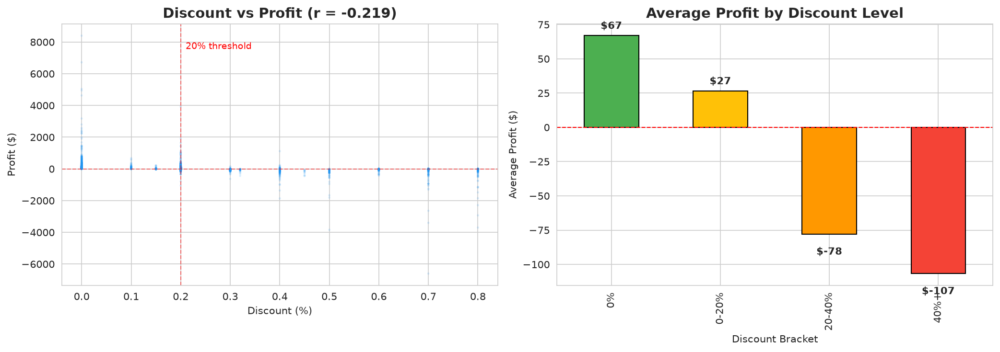

# Superstore Sales Analysis

A retail sales analysis of the public [Superstore Sales Dataset](https://www.kaggle.com/datasets/vivek468/superstore-dataset-final) on Kaggle. The project asks three focused business questions about revenue, profit, and customer behavior, then answers each with appropriate visualizations and statistics.

**Author:** Eman Mahmoud Ahmed Ali Omar
**Mentor:** Ali Mohamed — Gulf Plastics Industries (GPI)
**Internship:** Data Analysis Internship, 3 weeks
**Date:** 2026-09-16

---

## Dataset

- **Source:** [Superstore Sales Dataset on Kaggle](https://www.kaggle.com/datasets/vivek468/superstore-dataset-final)
- **File:** `data/superstore.csv` (committed, 9,994 rows, 21 columns)
- **Date range:** 2014-01-03 to 2017-12-30 (4 years)
- **Columns:** Order Date, Ship Date, Customer, Segment, Region, Category, Sub-Category, Sales, Quantity, Discount, Profit, etc.

---

## Project Objective

This project analyzes four years of Superstore sales to identify which products, regions, and customer segments drive the most revenue and profit, and to flag areas where sales and profit diverge — specifically, where high sales come with low or negative profit.

---

## Analysis Questions

1. **Which product categories and regions generate the most revenue and profit?** *(bar chart)*
2. **How have sales and profit changed over time (monthly/yearly)?** *(line chart)*
3. **How does discount level relate to profit?** *(scatter plot + correlation)*

See `notebooks/01_questions_and_setup.ipynb` for the full questions with justification and expected chart types.

---

## Tools

- Python 3
- pandas — data manipulation
- matplotlib / seaborn — visualization
- sqlite3 — basic SQL on a DataFrame
- Jupyter / Google Colab — notebook environment
- Git + GitHub — version control and publication

---

## How to Run

1. Clone the repository:
   ```bash
   git clone https://github.com/emanomar2006git/superstore-sales-analysis.git
   cd superstore-sales-analysis
   ```

2. (Optional) Create a virtual environment and install dependencies:
   ```bash
   python -m venv venv
   source venv/bin/activate   # on Windows: venv\Scripts\activate
   pip install pandas matplotlib seaborn jupyter
   ```

3. Launch the main notebook:
   ```bash
   jupyter notebook Superstore_Analysis.ipynb
   ```

4. Run all cells in order (Kernel → Restart & Run All).

> The notebook loads `data/superstore_clean.csv`. If that file is not present, launch the main notebook and it will fall back to loading raw data and applying minimal cleaning inline.

---

## Summary of Findings

> Lead with the most important finding. Each bullet must have a specific number. See [`findings.md`](./findings.md) for the full write-up.

- **Technology is the profit engine** — $836K in sales (36.4% of total) and $145K in profit (50.8% of total profit), with a 17.4% margin. Source: Q1.
- **Furniture is a revenue trap** — $742K in sales (32.3% of total) but only $18K profit (6.4% of total), a margin of just 2.5%. Source: Q1.
- **Sales grew 51.4% from 2014 to 2017** — from $484K to $733K, with consistent Q4 peaks (Q4 2017 hit $280K). Source: Q2.
- **High discounts destroy profit** — orders with >20% discount averaged -$97 profit vs $67 for no-discount orders (r = -0.220). Source: Q3.
- **West leads in both sales and profit** — $725K sales and $108K profit. Source: Q1.
- **11.7% of orders are outliers** — 1,167 orders totaling $1.48M in sales. Source: Additional Analysis.

See [`findings.md`](./findings.md) for the full write-up.

---

## Visual Highlights


*Figure 1: Total sales and profit by product category. Technology leads profit at 50.8% while Furniture has high sales but only 2.5% margin.*


*Figure 2: Monthly sales and profit trend (2014-2017). Sales grew 51.4% with consistent Q4 peaks.*


*Figure 3: Discount vs profit scatter plot and average profit by discount level. High discounts systematically destroy profit.*

---

## Repository Structure

```text
superstore-sales-analysis/
├── README.md
├── CONTEXT.md                     ← glossary (ubiquitous language)
├── docs/
│   └── adr/                       ← architectural decisions
├── Superstore_Analysis.ipynb      ← main reproducible notebook (the deliverable)
├── findings.md
├── walkthrough_script.md
├── data/
│   ├── superstore.csv             ← raw data (as downloaded, 9,994 rows)
│   └── superstore_clean.csv       ← cleaned data (output of 02_cleaning.ipynb)
├── notebooks/
│   ├── 01_questions_and_setup.ipynb  ← Day 15: questions + raw inspection (DONE)
│   ├── 02_cleaning.ipynb             ← Day 16: cleaning (DONE)
│   └── 03_eda_exploration.ipynb      ← Day 16: EDA (DONE)
└── images/
    └── *.png                      ← exported charts used in README
```

---

## Limitations

This analysis is limited by the dataset's 4-year span (2014-2017), making long-term trend conclusions unreliable. Cost data (shipping, manufacturing, overhead) is not included, so we can only measure gross profit, not net margin. Geography is at the state level, not store level, preventing granular location-based strategy. The discount-profit correlation (r=-0.22) is moderate, meaning discount is one factor among many affecting profit.

---

## Acknowledgments

- Dataset: [vivek468 on Kaggle](https://www.kaggle.com/datasets/vivek468/superstore-dataset-final)
- Internship supervisor: Ali Mohamed (Gulf Plastics Industries)
- Glossary: see [`CONTEXT.md`](./CONTEXT.md)
