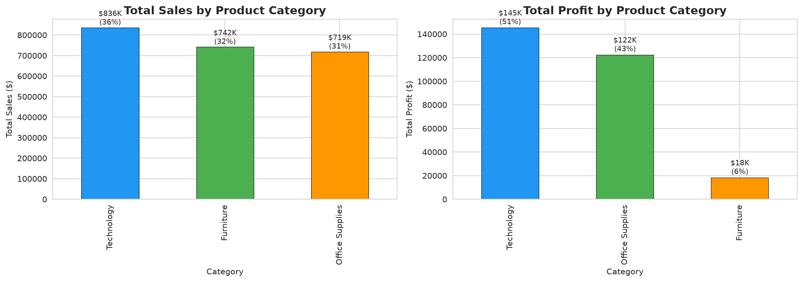
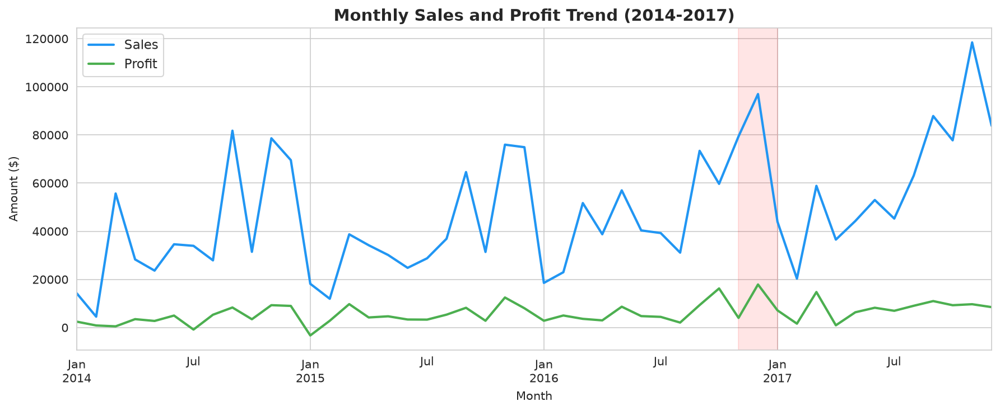

# Superstore Sales Analysis

A retail sales analysis of the public [Superstore Sales Dataset](https://www.kaggle.com/datasets/vivek468/superstore-dataset-final) on Kaggle. The project asks **exactly three locked business questions** (Q8: scope locked at 3 to keep Eman focused) about revenue, profit, and customer behavior, then answers each with appropriate visualizations and statistics.

**Author:** Eman Mahmoud Ahmed Ali Omar
**Mentor:** Ali Mohamed — Gulf Plastics Industries (GPI)
**Internship:** Data Analysis Internship, 3 weeks
**Date:** 2026-09-16

---

## Dataset

- **Source:** [Superstore Sales Dataset on Kaggle](https://www.kaggle.com/datasets/vivek468/superstore-dataset-final)
- **File:** `data/superstore.csv` (committed, 9,994 rows, 21 columns)
- **Date range:** 2014-01-03 to 2017-12-30 (4 years)
- **Columns:** Order Date, Ship Date, Customer, Segment, Region, Category, Sub-Category, Sales, Quantity, Discount, Profit, etc.

---

## Project Objective

This project analyzes four years of Superstore sales to identify which products, regions, and customer segments drive the most revenue and profit, and to flag areas where sales and profit diverge — specifically, where high sales come with low or negative profit.

---

## Analysis Questions

1. **Which product categories and regions generate the most revenue and profit?** *(bar chart)*
2. **How have sales and profit changed over time (monthly/yearly)?** *(line chart)*
3. **How does discount level relate to profit?** *(scatter plot + correlation)*

See `notebooks/01_questions_and_setup.ipynb` for the full questions with justification and expected chart types.

---

## Tools

- Python 3
- pandas — data manipulation
- matplotlib / seaborn — visualization
- sqlite3 — basic SQL on a DataFrame
- Jupyter / Google Colab — notebook environment
- Git + GitHub — version control and publication

---

## How to Run

1. Clone the repository:
   ```bash
   git clone https://github.com/emanomar2006git/superstore-sales-analysis.git
   cd superstore-sales-analysis
   ```

2. (Optional) Create a virtual environment and install dependencies:
   ```bash
   python -m venv venv
   source venv/bin/activate   # on Windows: venv\Scripts\activate
   pip install pandas matplotlib seaborn jupyter
   ```

3. Launch the main notebook:
   ```bash
   jupyter notebook Superstore_Analysis.ipynb
   ```

4. Run all cells in order (Kernel → Restart & Run All).

> The notebook loads `data/superstore_clean.csv`. If that file is not present, run `notebooks/02_cleaning.ipynb` first to generate it from `data/superstore.csv`.

---

## Summary of Findings

> TODO: Copy the 5–8 findings from [`findings.md`](./findings.md) here as a bulleted list once analysis is complete. Lead with the most important finding. Each bullet must have a specific number.

- **[TODO Finding 1]** — [one sentence with the supporting number]
- **[TODO Finding 2]** — [one sentence with the supporting number]
- **[TODO Finding 3]** — [one sentence with the supporting number]

See [`findings.md`](./findings.md) for the full write-up.

---

## Visual Highlights

> TODO: Export at least one chart as PNG to `images/` and embed here. Example:

<!-- Uncomment after exporting:

*Figure 1: Total revenue by product category. [One sentence interpretation.]*
-->


*Figure 2: TODO — Monthly sales trend. [One sentence interpretation.]*

---

## Repository Structure

```text
superstore-sales-analysis/
├── README.md
├── CONTEXT.md                     ← glossary (ubiquitous language)
├── docs/
│   └── adr/                       ← architectural decisions
├── Superstore_Analysis.ipynb      ← main reproducible notebook (the deliverable)
├── findings.md
├── walkthrough_script.md
├── data/
│   ├── superstore.csv             ← raw data (as downloaded, 9,994 rows)
│   └── superstore_clean.csv       ← cleaned data (output of 02_cleaning.ipynb)
├── notebooks/
│   ├── 01_questions_and_setup.ipynb  ← Day 15: questions + raw inspection (DONE)
│   ├── 02_cleaning.ipynb             ← Day 16: cleaning (TODO)
│   └── 03_eda_exploration.ipynb      ← Day 16: EDA (TODO)
└── images/
    └── *.png                      ← exported charts used in README
```

---

## Limitations

> TODO: One honest paragraph describing what this analysis cannot tell you. Examples:
> - The dataset covers only 4 years (2014-2017), which limits trend reliability.
> - Cost data is not provided, so margin analysis is not possible.
> - Geography is at the state level, not store level.

---

## Acknowledgments

- Dataset: [vivek468 on Kaggle](https://www.kaggle.com/datasets/vivek468/superstore-dataset-final)
- Internship supervisor: Ali Mohamed (Gulf Plastics Industries)
- Glossary: see [`CONTEXT.md`](./CONTEXT.md)
